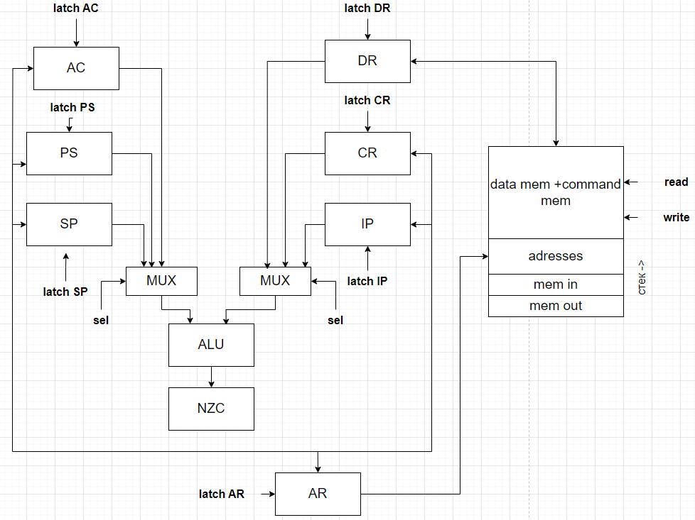

## Отчет

 > P33111 Вацет Мария Алексеевна
 > asm | acc | neum | hw | instr | struct | trap | mem | cstr | prob2 | spi
 >
 > Без усложнения

### Описание варианта

- **asm** -- синтаксис ассемблера. Необходима поддержка label-ов.
- **acc** -- система команд должна быть выстроена вокруг аккумулятора.
    - Инструкции -- изменяют значение, хранимое в аккумуляторе.
    - Ввод-вывод осуществляется через аккумулятор.
- **neum** -- фон Неймановская архитектура.
- **hw** -- hardwired. (Control Unit)Реализуется как часть модели.
- **instr** -- процессор необходимо моделировать с точностью до каждой инструкции (наблюдается состояние после каждой инструкции).
- **struct** -- машинный код в виде высокоуровневой структуры данных. Считается, что одна инструкция укладывается в одно машинное слово.
- **trap** -- ввод-вывод осуществляется токенами через систему прерываний.
- **mem** -- memory-mapped (порты ввода-вывода отображаются в память и доступ к ним осуществляется штатными командами),
    - отображение портов ввода-вывода в память должно конфигурироваться (можно hardcode-ом).
- **cstr** --  Null-terminated (C string)
- **prob2** -- Even Fibonacci numbers (сумма четных чисел Фибонначи, не превышающих 4 млн).
- **spi** -- ввод-вывод реализуется через интерфейс SPI (один канал на отправку и получение).
    - необходима визуализация передачи данных через SPI.

## Язык программирования

### Синтаксис

**Форма Бэкуса-Наура:**

```ebnf
<программа> ::= <строка_программы> | <строка_программы> <программа>
<строка_программы> ::= <адрес> | [<метка>] <адресная команда> <операнд> | 
[<метка>] <безадресная команда> | <метка константы> <константа> | <пустая строка> 
<метка> ::= <слово>":"
<метка константы> :: = ".word"
<адресная команда> = add | load | store | ... | sub | jmp | 
<безадресная команда> ::= cla | di | ei | ... | hlt
<операнд> ::= <число> | <метка>
<константа> ::=<число>|"<слово>"
<слово> ::= <символ> | <слово> <символ>
<число> ::= <цифра> | <число> <цифра>
<цифра> ::= 0| 1 | 2 | .. | 8 | 9
<символ> ::= a | b | c | ... | z | A | B | C | ... | Z | <цифра>
<комментарий> ::= ";" <слово>
```

### Краткое описание

Любая непустая строка -- это:

* **адресная команда**
    * может иметь метку в начале
    * указывается название команды и адрес операнда через пробел
* **безадресная команда**
    * может иметь метку в начале
    * указывается только название команды
* **константа**
    * имеет метку в начале
    * указывается метка константы `.word` и константа
    * константа может быть 16-битным знаковым числом
    * константа может быть строкой
* **адрес**
    * указывается специальное слово `org` и адрес в десятичном формате
    - Глобальная видимость данных
* **комментарий**
    это последовательность символов после *;*   

**Семантика**

- Видимость данных -- глобальная
- Поддерживаются целочисленные литералы
- Поддерживаются строковые литералы, символы стоки необходимо заключить в ""
- Код выполняется последовательно
- Программа обязательно должна включать метку `start:`, указывающую на 1-ю выполняемую интсрукцию. Эта метка не может
  указывать на константу.
- Название метки не должно совпадать с названием команды и не может начинаться с цифры.
- Метки находятся на одной строке с командами, операнды находятся на одной строке с командами.
- Пустые строки игнорируются, количество пробелов в начале и конце строки не важно.
- Любой текст, расположенный в конце строки после символа `';'` трактуется как комментарий.

Память выделяется статически, при запуске модели.

## Организация памяти

* Память команд и данныx --- общая
* Размер машинного слова --- `32` бит
* Память содержит `2^11` ячеек
* Ячейка с адресом `0` зарезервирована под вектор прерывания устройства ввода
* Адрес `2045` является указателем стека при старте процессора. Стек растет вверх.
* Ячейка с адресом `2046` маппится на устройство ввода
* Ячейка с адресом `2047` маппится на устройство вывода


* Поддерживаются следующие **виды адресаций**:
    * **Прямая**: в качестве аргумента команды передается адрес ячейки, значение в которой будет использовано как
      операнд.

    * **Косвенная**: в качестве аргумента команды передается адрес, по которому лежит адрес операнда.


* Существует несколько **регистров**:
    * Аккумулятор (AC): в него записываются результаты всех операций
    * Счетчик команд (IP): хранит адрес следующей выполняемой команды
    * Указатель стека (SP): при вызове прерывания текущее состояние счетчика команд сохраняется на стеке
    * Регистр данных (DR): хранит данные для записи в память и считывания из памяти
    * Регистр адреса (AR): хранит адрес последней ячейки в памяти, к которой было обращение
    * Регистр состояния (PS): хранит маркер того, что наступило прерывание. Пояснение:

      ```
        | ie/id | ir | N | Z | C |
         4        3    2   1   0
      ```
        * 0-й бит хранит флаг C
        * 1-й бит хранит флаг Z
        * 2-й бит хранит флаг N
        * 3-й бит содержит 1, если поступил запрос прерывания
        * 4-й бит содержит 1, если прерывания разрешены
    
## Система команд

Особенности процессора:

- Машинное слово -- `32` бита, знаковое.
- В качестве аргументов команды принимают `11` битные беззнаковые адреса

Каждая команда выполняется в несколько циклов:

1. Цикл выборки команды: по адресу из счетчика команд из памяти достается команда

- `IP -> AR, IP + 1 -> IP, mem[AR] -> DR, DR -> CR`

2. Цикл выборки операнда (для адресных команд): в регистр данных помещается адрес операнда, регистр данных передавется в
   регистр адреса, из памяти в регистр данных записывается значение операнда

- `CR[addr] -> DR, DR -> AR, mem[AR] -> DR`

3. Цикл исполнения: совершаются действия, необходимые для выполнения команды. Результаты вычисления записываются в
   аккумулятор
4. Цикл прерывания: проверяется, не произошел ли запрос на прерывание

### Набор инструкций

Вот обновленная таблица без столбцов "Адресная" и "Ветвление":

| Язык  | Количество тактов<br/>(без выборки адреса) | Описание                                                                                       |
|:------|:-------------------------------------------|:-----------------------------------------------------------------------------------------------|
| load  | 3                                          | загрузить значение из заданной ячейки                                                          |
| store | 3                                          | загрузить значение в заданную ячейку                                                           |
| add   | 3                                          | добавить значение из заданной ячейки к аккумулятору                                            |
| sub   | 3                                          | вычесть значение из заданной ячейки из аккумулятора                                            |
| jmp   | 3                                          | перейти в заданную ячейку                                                                      |
| cmp   | 3                                          | выставить флаги как результат вычитания заданной ячейки из аккумулятора, сохранить аккумулятор |
| jmn   | 3                                          | перейти в заданную ячейку если N = 1                                                           |
| jmnn  | 3                                          | перейти в заданную ячейку если N = 0                                                           |
| jmc   | 3                                          | перейти в заданную ячейку если C = 1                                                           |
| jmnc  | 3                                          | перейти в заданную ячейку если C = 0                                                           |
| jmz   | 3                                          | перейти в заданную ячейку если Z = 1                                                           |
| jmnz  | 3                                          | перейти в заданную ячейку если Z = 0                                                           |
| asl   | 2                                          | сдвинуть значение в аккумуляторе влево, AC[15] -> C                                            |
| asr   | 2                                          | сдвинуть значение в аккумуляторе вправо, AC[0] -> C                                            |
| dec   | 2                                          | уменьшить значение в аккумуляторе на 1                                                         |
| inc   | 2                                          | увеличить значение в аккумуляторе на 1                                                         |
| cla   | 2                                          | очистить аккумулятор (записать в него 0)                                                       |
| hlt   | 2                                          | остановить работу программы                                                                    |
| iret  | 2                                          | возрат из прерывания                                                                           |
| push  | 2                                          | положить значение из аккумулятора на стек                                                      |
| pop   | 2                                          | достать значение с вершины стека и записать в аккумулятор                                      |
| di    | 2                                          | запретить прерывания                                                                           |
| ei    | 2                                          | разрешить прерывания                                                                           |
| nop   | 1                                          | отсутствие операции                                                                            |


### Кодирование инструкций

- Машинный код сереализуется в список JSON.
- Один элемент списка, одна инструкция или константа.

Пример команды `load (1)` и константы 20:

```json
[
  {
    "index": 10,
    "opcode": "load",
    "operand": 1,
    "value": 0,
    "address": True
  },
  {
    "index": 2,
    "value": 20,
    "opcode" : "nop"
  }
]
```

где:

- `index` -- адрес объекта в памяти;
- `opcode` -- код оператора, идентификатор команды; У констант для упрощения всегда "nop"
- `operand` -- аргумент команды, адрес ячейки над которой совершается операция. Отсуствует у безадресных команд и
  констант;
- `address` -- логическое поле, имеющее значение True, если адресация косвенная, и False, если прямая.
- `value` -- значение ячейке с адресом index, если она будет интерпретирована как данные. Так как команды сериализуются
  в высокоуровневую структуру, было принято решение установить у команд это значение в 0.

## Транслятор

Интерфейс командной строки: `translator.py <input_file> <target_file>`

Этапы трансляции (функция `translate`):

1. Выделение меток из кода, проверка их корректности (не совпадают с названиями команд, отсуствуют дубликаты)
2. Парсинг кода построчно, определение типа команды (адресная, безадресная, константа)
3. Генерация машинного кода в зависимости от типа команды

Правила генерации машинного кода:

- Метки не сохраняются в машинном коде. Метки, использованные в качестве операнда, преобразуются к адресам команд

## Модель процессора

Интерфейс командной строки: `mashine.py <machine_code_file> <input_file>`


### DataPath

Реализован в классе `DataPath`.



`data_memory` -- однопортовая память, поэтому либо читаем, либо пишем.
`registers`
Сигналы (реализованы в виде методов класса):
В

- `set_reg` -- защёлкнуть выбранное значение в регистре с указанным именем
- `read_output` --- считать данные из `mem[AR]` в регистр `DR`
- `write_output` --- записать данные из регистра `DR` в `mem[AR]`

В виде отдельного класса реализовано арифметико-логическое устройство (АЛУ)

- в данном классе реализован метод `calc`, принимающий аргументы с одного или двух входов и совершающий над ними
  арифметико-логическую операцию
- в результате выполнения операций устанавливаются следующие флаги
    - `Z` -- значение в аккумуляторе равно 0
    - `N` -- значение в аккумуляторе отрицательно
    - `C` -- произошло переполнение (перенос из 16-го бита)

### ControlUnit

Реализован в классе `ControlUnit`.


- Метод `decode_and_execute_instruction` моделирует выполнение полного цикла инструкции (цикл выборки инструкции,
  операнда, исполнения)
- После завершения цикла исполнения проверяется, не произошел ли запрос прерывания, и разрешены ли прерывания. Если оба
  условия верны, то вызывается метод `process_interrupt`
- В рамках реализованной модели на python существуют счетчик количества инструкций только для наложения ограничения на
  кол-во шагов моделирования

Особенности работы модели:

- Цикл симуляции осуществляется в функции `simulation`.
- Шаг моделирования соответствует одному такту процессора с выводом состояния в журнал.
- Для журнала состояний процессора используется стандартный модуль `logging`.
- Количество инструкций для моделирования лимитировано.
- Остановка моделирования осуществляется при:
    - превышении лимита количества выполняемых инструкций;
    - исключении `Incorrect unary operation` или `Incorrect binary operation`-- если в ALU поданны некорректные бинврные или унарные операции
    - если выполнена инструкция `hlt`.

- обработка прерываний осуществляется в методе `process_interrupt`
    - на стек сохраняются текущие значения счетчика команд (IP), и регистра состояния (PS)
    - в IP записывается адрес из вектора прерываний (хранится в ячейке 0)
    - выполняются все команды для обработки прерывания. При выполнении команды  `iret` происходит возврат в основную
      программу
    - из стека достаются значения IP и PS и присваиваются соответствующим регистрам

Проверка наличия запроса прерывания осуществляется после завершения цикла выполнения очередной команды.

- Вложенные прерывания возможны, программист должен управлять запретом и разрешением прерываний самостоятельно при
  помощи команд:
    - ei (enable interrupt) --- разрешить прерывания
    - di (disable interrupt) --- запретить прерывания
- Все регистры кроме PS и IP программист должен самостоятельно сохранять на стек в методе-обработчике прерываний.

## Тестирование

Реализованные програмы

1. [hello world](tests/asm/hello_world.asm): вывести на экран строку Hello, world!
2. [cat](tests/asm/cat.asm): программа `cat`, повторяем ввод на выводе.
3. [hello_username](tests/asm/hello_user.asm) -- программа hello user: запросить у пользователя его
   имя, считать его, вывести на экран приветствие
4. [prob2](tests/asm/prob2.asm): найти сумму всех четных чисел Фибоначчи, не превышающих 100.

Интеграционные тесты реализованы тут [integration_test](csa_lab3/integration_test.py):

- через golden tests, конфигурация которых лежит в папке [golden](./golden)

CI расположена в [CI](.github/workflows/python-app.yml)

где:

- `ryukzak/python-tools` -- docker образ, который содержит все необходимые для проверки утилиты.
  Подробнее: [Dockerfile](/src/brailfuck/Dockerfile)
- `poetry` -- управления зависимостями для языка программирования Python.
- `coverage` -- формирование отчёта об уровне покрытия исходного кода.
- `pytest` -- утилита для запуска тестов.
- `ruff` -- утилита для форматирования и проверки стиля кодирования.

Пример запуска:

```shell
$ python ./translator.py tests/asm/hello_user.asm target.out
source LoC: 86 code instr: 90

$ ./machine.py target.out examples/input/test.txt
  and: nop  | AC 0       | IP: 31   | AR: 30   | PS: 00010 | DR: 0       | SP : 2045 | mem[AR] 0       | mem[SP] : 0   | CR: nop          |


Command: load | AC 72      | IP: 32   | AR: 2    | PS: 00000 | DR: 72      | SP : 2045 | mem[AR] 72      | mem[SP] : 0   | CR: load 16      |
OUTPUT H


Command: store | AC 72      | IP: 33   | AR: 2047 | PS: 00000 | DR: 72      | SP : 2045 | mem[AR] 72      | mem[SP] : 0   | CR: store 18     |


Command: jmz  | AC 72      | IP: 34   | AR: 38   | PS: 00000 | DR: 0       | SP : 2045 | mem[AR] 0       | mem[SP] : 0   | CR: jmz 38       |


Command: load | AC 2       | IP: 35   | AR: 16   | PS: 00000 | DR: 2       | SP : 2045 | mem[AR] 2       | mem[SP] : 0   | CR: load 16      |


Command: inc  | AC 3       | IP: 36   | AR: 35   | PS: 00000 | DR: 2       | SP : 2045 | mem[AR] 0       | mem[SP] : 0   | CR: inc          |


Command: store | AC 3       | IP: 37   | AR: 16   | PS: 00000 | DR: 3       | SP : 2045 | mem[AR] 3       | mem[SP] : 0   | CR: store 16     |


Command: jmp  | AC 3       | IP: 31   | AR: 31   | PS: 00000 | DR: 0       | SP : 2045 | mem[AR] 0       | mem[SP] : 0   | CR: jmp 31       |


Command: load | AC 101     | IP: 32   | AR: 3    | PS: 00000 | DR: 101     | SP : 2045 | mem[AR] 101     | mem[SP] : 0   | CR: load 16      |
OUTPUT e


Command: store | AC 101     | IP: 33   | AR: 2047 | PS: 00000 | DR: 101     | SP : 2045 | mem[AR] 101     | mem[SP] : 0   | CR: store 18     |


Command: jmz  | AC 101     | IP: 34   | AR: 38   | PS: 00000 | DR: 0       | SP : 2045 | mem[AR] 0       | mem[SP] : 0   | CR: jmz 38       |


Command: load | AC 3       | IP: 35   | AR: 16   | PS: 00000 | DR: 3       | SP : 2045 | mem[AR] 3       | mem[SP] : 0   | CR: load 16      |


Command: inc  | AC 4       | IP: 36   | AR: 35   | PS: 00000 | DR: 3       | SP : 2045 | mem[AR] 0       | mem[SP] : 0   | CR: inc          |


Command: store | AC 4       | IP: 37   | AR: 16   | PS: 00000 | DR: 4       | SP : 2045 | mem[AR] 4       | mem[SP] : 0   | CR: store 16     |


Command: jmp  | AC 4       | IP: 31   | AR: 31   | PS: 00000 | DR: 0       | SP : 2045 | mem[AR] 0       | mem[SP] : 0   | CR: jmp 31       |


Command: load | AC 108     | IP: 32   | AR: 4    | PS: 00000 | DR: 108     | SP : 2045 | mem[AR] 108     | mem[SP] : 0   | CR: load 16      |
OUTPUT l


Command: store | AC 108     | IP: 33   | AR: 2047 | PS: 00000 | DR: 108     | SP : 2045 | mem[AR] 108     | mem[SP] : 0   | CR: store 18     |


Command: jmz  | AC 108     | IP: 34   | AR: 38   | PS: 00000 | DR: 0       | SP : 2045 | mem[AR] 0       | mem[SP] : 0   | CR: jmz 38       |
INPUT U


Command: load | AC 4       | IP: 35   | AR: 16   | PS: 01000 | DR: 4       | SP : 2045 | mem[AR] 4       | mem[SP] : 0   | CR: load 16      |


Command: inc  | AC 5       | IP: 36   | AR: 35   | PS: 01000 | DR: 4       | SP : 2045 | mem[AR] 0       | mem[SP] : 0   | CR: inc          |


Command: store | AC 5       | IP: 37   | AR: 16   | PS: 01000 | DR: 5       | SP : 2045 | mem[AR] 5       | mem[SP] : 0   | CR: store 16     |


Command: jmp  | AC 5       | IP: 31   | AR: 31   | PS: 01000 | DR: 0       | SP : 2045 | mem[AR] 0       | mem[SP] : 0   | CR: jmp 31       |


Command: load | AC 108     | IP: 32   | AR: 5    | PS: 01000 | DR: 108     | SP : 2045 | mem[AR] 108     | mem[SP] : 0   | CR: load 16      |
OUTPUT l


Command: store | AC 108     | IP: 33   | AR: 2047 | PS: 01000 | DR: 108     | SP : 2045 | mem[AR] 108     | mem[SP] : 0   | CR: store 18     |


Command: jmz  | AC 108     | IP: 34   | AR: 38   | PS: 01000 | DR: 0       | SP : 2045 | mem[AR] 0       | mem[SP] : 0   | CR: jmz 38       |


Command: load | AC 5       | IP: 35   | AR: 16   | PS: 01000 | DR: 5       | SP : 2045 | mem[AR] 5       | mem[SP] : 0   | CR: load 16      |


Command: inc  | AC 6       | IP: 36   | AR: 35   | PS: 01000 | DR: 5       | SP : 2045 | mem[AR] 0       | mem[SP] : 0   | CR: inc          |


Command: store | AC 6       | IP: 37   | AR: 16   | PS: 01000 | DR: 6       | SP : 2045 | mem[AR] 6       | mem[SP] : 0   | CR: store 16     |


Command: jmp  | AC 6       | IP: 31   | AR: 31   | PS: 01000 | DR: 0       | SP : 2045 | mem[AR] 0       | mem[SP] : 0   | CR: jmp 31       |


Command: load | AC 111     | IP: 32   | AR: 6    | PS: 01000 | DR: 111     | SP : 2045 | mem[AR] 111     | mem[SP] : 0   | CR: load 16      |
OUTPUT o


Command: store | AC 111     | IP: 33   | AR: 2047 | PS: 01000 | DR: 111     | SP : 2045 | mem[AR] 111     | mem[SP] : 0   | CR: store 18     |


Command: jmz  | AC 111     | IP: 34   | AR: 38   | PS: 01000 | DR: 0       | SP : 2045 | mem[AR] 0       | mem[SP] : 0   | CR: jmz 38       |


Command: load | AC 6       | IP: 35   | AR: 16   | PS: 01000 | DR: 6       | SP : 2045 | mem[AR] 6       | mem[SP] : 0   | CR: load 16      |


Command: inc  | AC 7       | IP: 36   | AR: 35   | PS: 01000 | DR: 6       | SP : 2045 | mem[AR] 0       | mem[SP] : 0   | CR: inc          |


Command: store | AC 7       | IP: 37   | AR: 16   | PS: 01000 | DR: 7       | SP : 2045 | mem[AR] 7       | mem[SP] : 0   | CR: store 16     |


Command: jmp  | AC 7       | IP: 31   | AR: 31   | PS: 01000 | DR: 0       | SP : 2045 | mem[AR] 0       | mem[SP] : 0   | CR: jmp 31       |


Command: load | AC 44      | IP: 32   | AR: 7    | PS: 01000 | DR: 44      | SP : 2045 | mem[AR] 44      | mem[SP] : 0   | CR: load 16      |
OUTPUT ,


Command: store | AC 44      | IP: 33   | AR: 2047 | PS: 01000 | DR: 44      | SP : 2045 | mem[AR] 44      | mem[SP] : 0   | CR: store 18     |


Command: jmz  | AC 44      | IP: 34   | AR: 38   | PS: 01000 | DR: 0       | SP : 2045 | mem[AR] 0       | mem[SP] : 0   | CR: jmz 38       |


Command: load | AC 7       | IP: 35   | AR: 16   | PS: 01000 | DR: 7       | SP : 2045 | mem[AR] 7       | mem[SP] : 0   | CR: load 16      |


Command: inc  | AC 8       | IP: 36   | AR: 35   | PS: 01000 | DR: 7       | SP : 2045 | mem[AR] 0       | mem[SP] : 0   | CR: inc          |
INPUT s


Command: store | AC 8       | IP: 37   | AR: 16   | PS: 01000 | DR: 8       | SP : 2045 | mem[AR] 8       | mem[SP] : 0   | CR: store 16     |


Command: jmp  | AC 8       | IP: 31   | AR: 31   | PS: 01000 | DR: 0       | SP : 2045 | mem[AR] 0       | mem[SP] : 0   | CR: jmp 31       |


Command: load | AC 32      | IP: 32   | AR: 8    | PS: 01000 | DR: 32      | SP : 2045 | mem[AR] 32      | mem[SP] : 0   | CR: load 16      |
OUTPUT


Command: store | AC 32      | IP: 33   | AR: 2047 | PS: 01000 | DR: 32      | SP : 2045 | mem[AR] 32      | mem[SP] : 0   | CR: store 18     |


Command: jmz  | AC 32      | IP: 34   | AR: 38   | PS: 01000 | DR: 0       | SP : 2045 | mem[AR] 0       | mem[SP] : 0   | CR: jmz 38       |


Command: load | AC 8       | IP: 35   | AR: 16   | PS: 01000 | DR: 8       | SP : 2045 | mem[AR] 8       | mem[SP] : 0   | CR: load 16      |


Command: inc  | AC 9       | IP: 36   | AR: 35   | PS: 01000 | DR: 8       | SP : 2045 | mem[AR] 0       | mem[SP] : 0   | CR: inc          |


Command: store | AC 9       | IP: 37   | AR: 16   | PS: 01000 | DR: 9       | SP : 2045 | mem[AR] 9       | mem[SP] : 0   | CR: store 16     |


Command: jmp  | AC 9       | IP: 31   | AR: 31   | PS: 01000 | DR: 0       | SP : 2045 | mem[AR] 0       | mem[SP] : 0   | CR: jmp 31       |


Command: load | AC 87      | IP: 32   | AR: 9    | PS: 01000 | DR: 87      | SP : 2045 | mem[AR] 87      | mem[SP] : 0   | CR: load 16      |
OUTPUT W


Command: store | AC 87      | IP: 33   | AR: 2047 | PS: 01000 | DR: 87      | SP : 2045 | mem[AR] 87      | mem[SP] : 0   | CR: store 18     |


Command: jmz  | AC 87      | IP: 34   | AR: 38   | PS: 01000 | DR: 0       | SP : 2045 | mem[AR] 0       | mem[SP] : 0   | CR: jmz 38       |


Command: load | AC 9       | IP: 35   | AR: 16   | PS: 01000 | DR: 9       | SP : 2045 | mem[AR] 9       | mem[SP] : 0   | CR: load 16      |


Command: inc  | AC 10      | IP: 36   | AR: 35   | PS: 01000 | DR: 9       | SP : 2045 | mem[AR] 0       | mem[SP] : 0   | CR: inc          |


Command: store | AC 10      | IP: 37   | AR: 16   | PS: 01000 | DR: 10      | SP : 2045 | mem[AR] 10      | mem[SP] : 0   | CR: store 16     |


Command: jmp  | AC 10      | IP: 31   | AR: 31   | PS: 01000 | DR: 0       | SP : 2045 | mem[AR] 0       | mem[SP] : 0   | CR: jmp 31       |


Command: load | AC 111     | IP: 32   | AR: 10   | PS: 01000 | DR: 111     | SP : 2045 | mem[AR] 111     | mem[SP] : 0   | CR: load 16      |
OUTPUT o


Command: store | AC 111     | IP: 33   | AR: 2047 | PS: 01000 | DR: 111     | SP : 2045 | mem[AR] 111     | mem[SP] : 0   | CR: store 18     |


Command: jmz  | AC 111     | IP: 34   | AR: 38   | PS: 01000 | DR: 0       | SP : 2045 | mem[AR] 0       | mem[SP] : 0   | CR: jmz 38       |


Command: load | AC 10      | IP: 35   | AR: 16   | PS: 01000 | DR: 10      | SP : 2045 | mem[AR] 10      | mem[SP] : 0   | CR: load 16      |


Command: inc  | AC 11      | IP: 36   | AR: 35   | PS: 01000 | DR: 10      | SP : 2045 | mem[AR] 0       | mem[SP] : 0   | CR: inc          |


Command: store | AC 11      | IP: 37   | AR: 16   | PS: 01000 | DR: 11      | SP : 2045 | mem[AR] 11      | mem[SP] : 0   | CR: store 16     |


Command: jmp  | AC 11      | IP: 31   | AR: 31   | PS: 01000 | DR: 0       | SP : 2045 | mem[AR] 0       | mem[SP] : 0   | CR: jmp 31       |


Command: load | AC 114     | IP: 32   | AR: 11   | PS: 01000 | DR: 114     | SP : 2045 | mem[AR] 114     | mem[SP] : 0   | CR: load 16      |
OUTPUT r


Command: store | AC 114     | IP: 33   | AR: 2047 | PS: 01000 | DR: 114     | SP : 2045 | mem[AR] 114     | mem[SP] : 0   | CR: store 18     |


Command: jmz  | AC 114     | IP: 34   | AR: 38   | PS: 01000 | DR: 0       | SP : 2045 | mem[AR] 0       | mem[SP] : 0   | CR: jmz 38       |


Command: load | AC 11      | IP: 35   | AR: 16   | PS: 01000 | DR: 11      | SP : 2045 | mem[AR] 11      | mem[SP] : 0   | CR: load 16      |


Command: inc  | AC 12      | IP: 36   | AR: 35   | PS: 01000 | DR: 11      | SP : 2045 | mem[AR] 0       | mem[SP] : 0   | CR: inc          |


Command: store | AC 12      | IP: 37   | AR: 16   | PS: 01000 | DR: 12      | SP : 2045 | mem[AR] 12      | mem[SP] : 0   | CR: store 16     |
INPUT e


Command: jmp  | AC 12      | IP: 31   | AR: 31   | PS: 01000 | DR: 0       | SP : 2045 | mem[AR] 0       | mem[SP] : 0   | CR: jmp 31       |


Command: load | AC 108     | IP: 32   | AR: 12   | PS: 01000 | DR: 108     | SP : 2045 | mem[AR] 108     | mem[SP] : 0   | CR: load 16      |
OUTPUT l


Command: store | AC 108     | IP: 33   | AR: 2047 | PS: 01000 | DR: 108     | SP : 2045 | mem[AR] 108     | mem[SP] : 0   | CR: store 18     |


Command: jmz  | AC 108     | IP: 34   | AR: 38   | PS: 01000 | DR: 0       | SP : 2045 | mem[AR] 0       | mem[SP] : 0   | CR: jmz 38       |


Command: load | AC 12      | IP: 35   | AR: 16   | PS: 01000 | DR: 12      | SP : 2045 | mem[AR] 12      | mem[SP] : 0   | CR: load 16      |


Command: inc  | AC 13      | IP: 36   | AR: 35   | PS: 01000 | DR: 12      | SP : 2045 | mem[AR] 0       | mem[SP] : 0   | CR: inc          |


Command: store | AC 13      | IP: 37   | AR: 16   | PS: 01000 | DR: 13      | SP : 2045 | mem[AR] 13      | mem[SP] : 0   | CR: store 16     |


Command: jmp  | AC 13      | IP: 31   | AR: 31   | PS: 01000 | DR: 0       | SP : 2045 | mem[AR] 0       | mem[SP] : 0   | CR: jmp 31       |


Command: load | AC 100     | IP: 32   | AR: 13   | PS: 01000 | DR: 100     | SP : 2045 | mem[AR] 100     | mem[SP] : 0   | CR: load 16      |
OUTPUT d


Command: store | AC 100     | IP: 33   | AR: 2047 | PS: 01000 | DR: 100     | SP : 2045 | mem[AR] 100     | mem[SP] : 0   | CR: store 18     |


Command: jmz  | AC 100     | IP: 34   | AR: 38   | PS: 01000 | DR: 0       | SP : 2045 | mem[AR] 0       | mem[SP] : 0   | CR: jmz 38       |


Command: load | AC 13      | IP: 35   | AR: 16   | PS: 01000 | DR: 13      | SP : 2045 | mem[AR] 13      | mem[SP] : 0   | CR: load 16      |


Command: inc  | AC 14      | IP: 36   | AR: 35   | PS: 01000 | DR: 13      | SP : 2045 | mem[AR] 0       | mem[SP] : 0   | CR: inc          |


Command: store | AC 14      | IP: 37   | AR: 16   | PS: 01000 | DR: 14      | SP : 2045 | mem[AR] 14      | mem[SP] : 0   | CR: store 16     |


Command: jmp  | AC 14      | IP: 31   | AR: 31   | PS: 01000 | DR: 0       | SP : 2045 | mem[AR] 0       | mem[SP] : 0   | CR: jmp 31       |


Command: load | AC 33      | IP: 32   | AR: 14   | PS: 01000 | DR: 33      | SP : 2045 | mem[AR] 33      | mem[SP] : 0   | CR: load 16      |
OUTPUT !


Command: store | AC 33      | IP: 33   | AR: 2047 | PS: 01000 | DR: 33      | SP : 2045 | mem[AR] 33      | mem[SP] : 0   | CR: store 18     |


Command: jmz  | AC 33      | IP: 34   | AR: 38   | PS: 01000 | DR: 0       | SP : 2045 | mem[AR] 0       | mem[SP] : 0   | CR: jmz 38       |


Command: load | AC 14      | IP: 35   | AR: 16   | PS: 01000 | DR: 14      | SP : 2045 | mem[AR] 14      | mem[SP] : 0   | CR: load 16      |


Command: inc  | AC 15      | IP: 36   | AR: 35   | PS: 01000 | DR: 14      | SP : 2045 | mem[AR] 0       | mem[SP] : 0   | CR: inc          |


Command: store | AC 15      | IP: 37   | AR: 16   | PS: 01000 | DR: 15      | SP : 2045 | mem[AR] 15      | mem[SP] : 0   | CR: store 16     |


Command: jmp  | AC 15      | IP: 31   | AR: 31   | PS: 01000 | DR: 0       | SP : 2045 | mem[AR] 0       | mem[SP] : 0   | CR: jmp 31       |


Command: load | AC 0       | IP: 32   | AR: 15   | PS: 01010 | DR: 0       | SP : 2045 | mem[AR] 0       | mem[SP] : 0   | CR: load 16      |
OUTPUT 0


Command: store | AC 0       | IP: 33   | AR: 2047 | PS: 01010 | DR: 0       | SP : 2045 | mem[AR] 0       | mem[SP] : 0   | CR: store 18     |


Command: jmz  | AC 0       | IP: 38   | AR: 38   | PS: 01010 | DR: 0       | SP : 2045 | mem[AR] 0       | mem[SP] : 0   | CR: jmz 38       |
Output: ['H', 'e', 'l', 'l', 'o', ',', ' ', 'W', 'o', 'r', 'l', 'd', '!', 0]
Instruction number: 95
Ticks: 300

```

Выводится:
- Исполняемая инструкция
- Значения всех регистров, кроме PS и CR выводятся в десятичном формате
- Значение регистра `PS` выводится в двоичном формате для удобного определения флагов, наличия запроса прерываний и тд.
- В качестве значения регистра `CR`выводятся код оператора и операнд (при наличии)
- Если в какой-то регистр записан символ, в листинге выводится его код
- Логи INPUT/OUPUT символа

Пример запуска golden tests:

``` shell
$ poetry run pytest . -v --update-goldens
============================================= test session starts ==============================================
platform win32 -- Python 3.12.1, pytest-7.4.4, pluggy-1.4.0 -- C:\Users\Vatset Masha\AppData\Local\pypoetry\Cache\virtualenvs\acs-lab3-Sprv7huD-py3.12\Scripts\python.exe
cachedir: .pytest_cache
rootdir: C:\Users\Vatset Masha\Desktop\acs-lab3
configfile: pyproject.toml
plugins: golden-0.2.2
collected 4 items                                                                                                

integration_test.py::test_translator_and_machine[golden/cat.yml] PASSED                                                                                                                                                             [ 25%]
integration_test.py::test_translator_and_machine[golden/hello_user.yml] PASSED                                                                                                                                                      [ 50%]
integration_test.py::test_translator_and_machine[golden/hello_world.yml] PASSED                                                                                                                                                     [ 75%]
integration_test.py::test_translator_and_machine[golden/prob2.yml] PASSED                                                                                                                                                           [100%]
============================================== 5 passed in 0.97s ===============================================
$ poetry run ruff format .
5 files left unchanged

```

`
